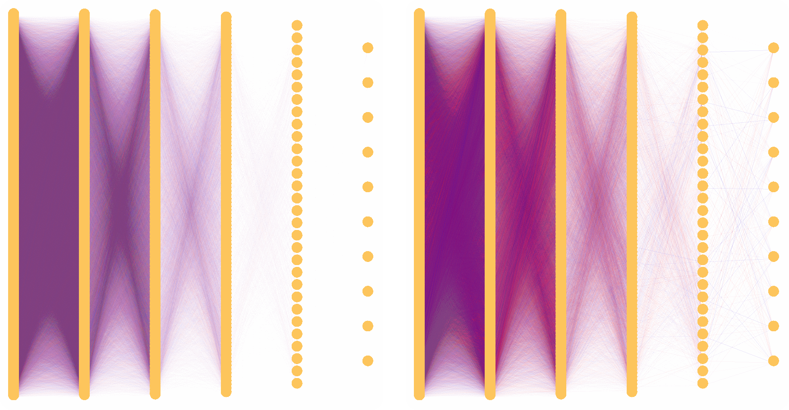
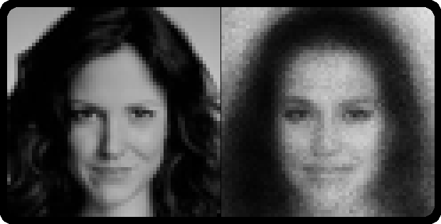
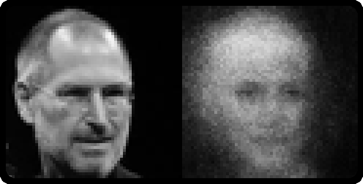
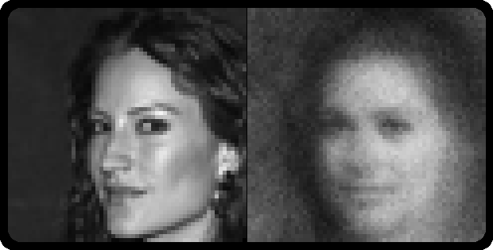

# Neural Network

A simple Neural Network build from scratch. The SFML library is used to visualize the Network.

## Features

#### Network

- Create Network with any Number of Layers and Neurons
- Calculate Outputs: Calculates the Outputs with given Inputs
- Feed Forward: Calculates the Outputs with given Inputs starting from given start Layer
- Train the Network with either one Solution or multiple Solutions
- Avaiable Activation Functions:
  - ReLU: r
  - Parametric ReLU: "lr"
  - Sigmoid: "s"
  - Sofmax: "soft" (only Output)
- Output Activation Function can be specified
- Avaible Error Functions:
  - Mean Square Error: "mse"
  - Cross Entropy: "ce"

#### Programm

- Save and load the Network: S / L
- Start/Stop training: Space
- Visualize:
  - Network
  - Outputs as Numbers and Image
  - DrawingField used as Input
- Load MNIST CSV Data

## Example

### Training
The left Network is not trained. The right Network is trained to recognize digits.




### Autoencoder
A trained Autoencoder's goal is to reconstruct its input. This Network was trained to reconstruct a face from the CelebFaces Attributes (CelebA) Dataset. The Network consists of the Encoder, which compresses the input to a lower size and the Decoder, that will reconstruct the input.  

At the left side are the input images and at the right side are the reconstruct images.









## Build

#### Downloads

|   Software   | **SFML**                                              | **CMake**                            | **MinGW**                                             |
| :----------: | ----------------------------------------------------- | ------------------------------------ | ----------------------------------------------------- |
| **Version**  | 2.5.2 MinGW 64                                        | 3.22+ Msi                            | 10.3.0 tdm64-gcc                                      |
| **Download** | [SFML](https://www.sfml-dev.org/download/sfml/2.5.1/) | [CMake](https://cmake.org/download/) | [MinGW](https://jmeubank.github.io/tdm-gcc/download/) |

#### Build

- Extract the zip file
- Shift the extractat "SFML-2.5.1" folder into the main folder
- start cmd inside the main folder and run:

```sh
mkdir build
cd build
cmake .. -G "MinGW Makefiles"
mingw32-make
```

- start the .exe inside the build folder